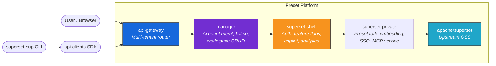
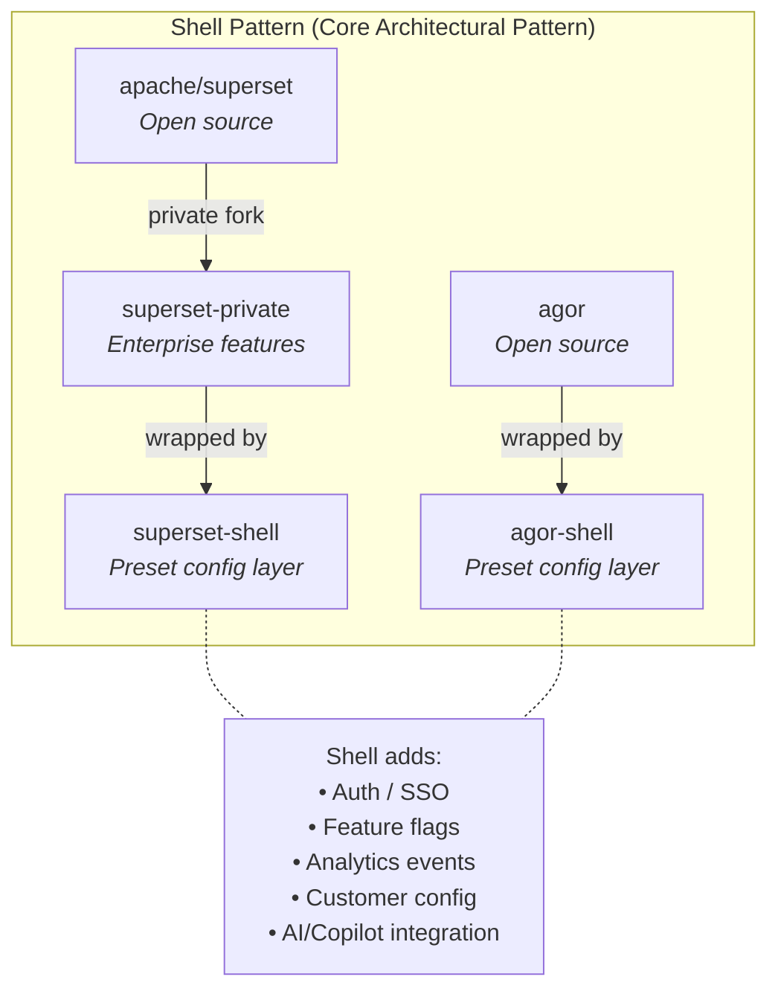
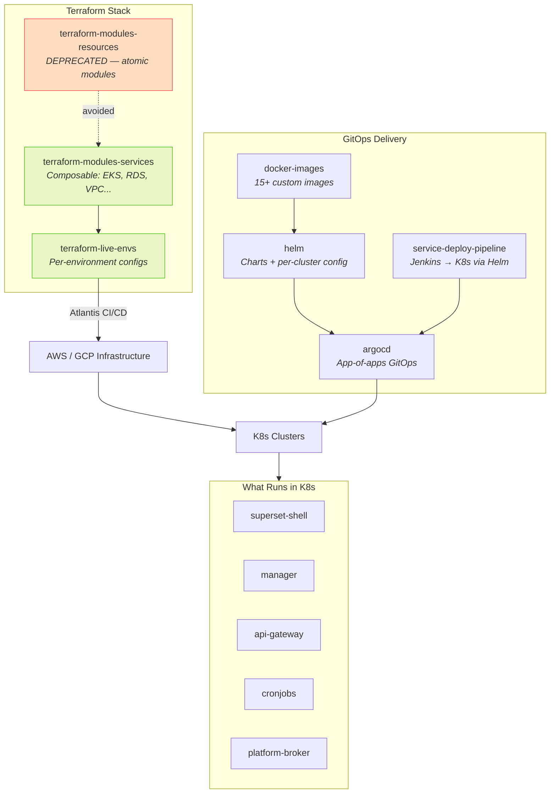
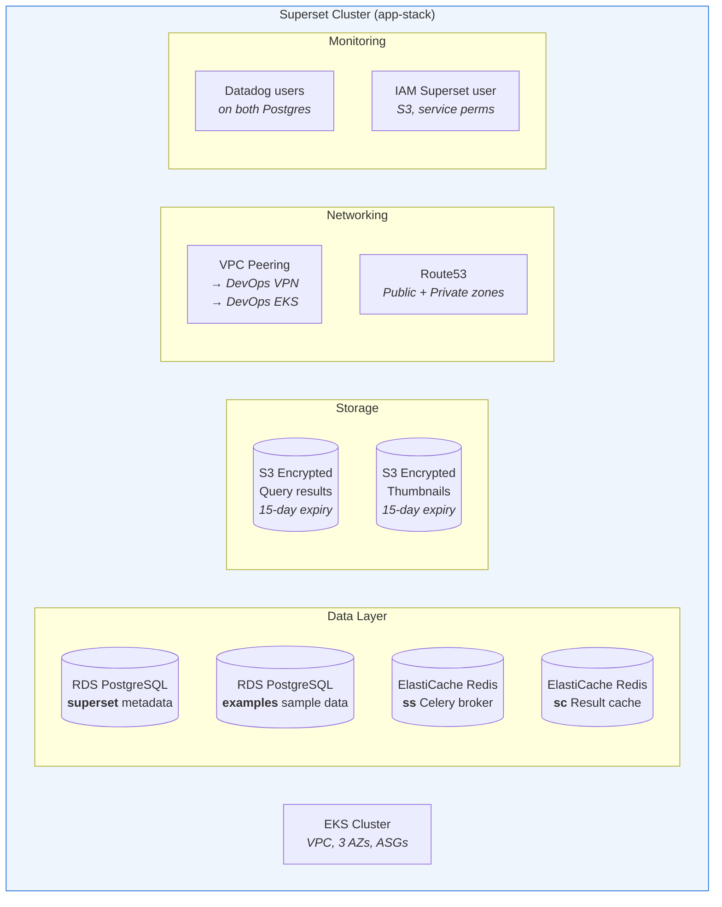
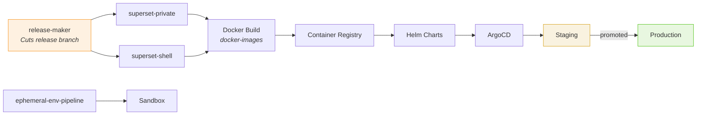
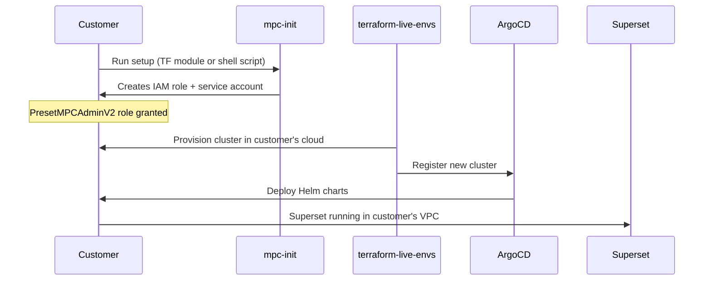
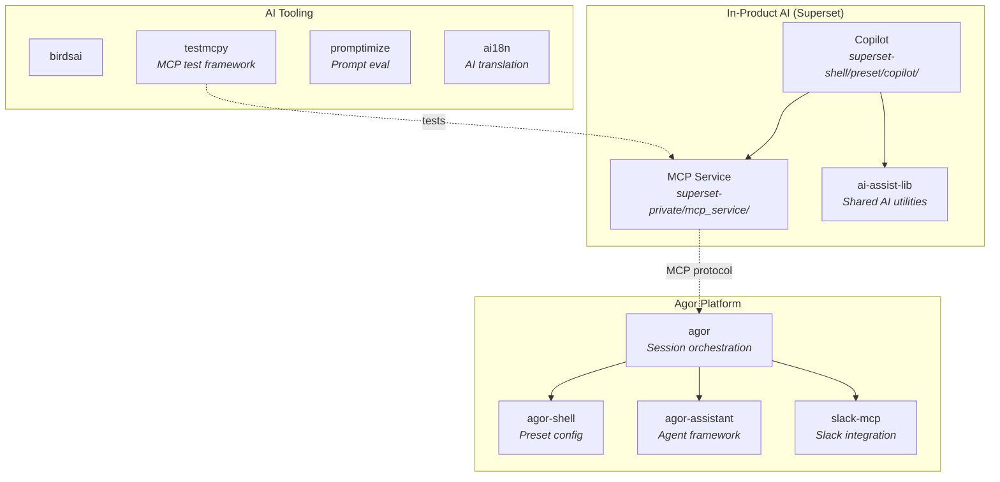
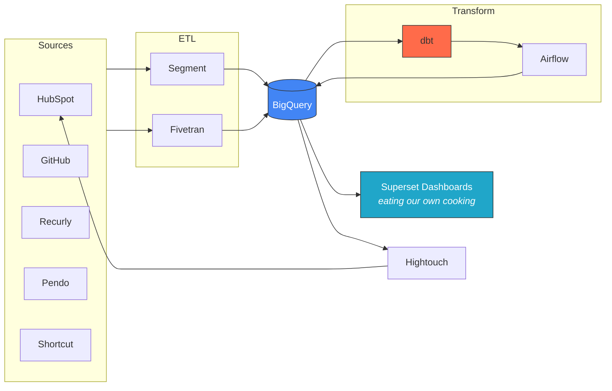

# Preset Architecture — Mermaid Diagrams

Reference diagrams for the Preset Architect. Use these in conversations, on boards, or when answering architecture questions.

---

## 1. Core Platform — Request Path

---

## 2. The Shell Pattern

---

## 3. Three Deployment Models

```mermaid
flowchart TB
    subgraph SaaS["SaaS (Multi-tenant)"]
        direction LR
        S1[Preset manages everything]
        S2[Shared K8s clusters]
        S3[app.preset.io]
        S1 --- S2 --- S3
    end

    subgraph MPC["MPC (Managed Private Cloud)"]
        direction LR
        M1[Customer runs mpc-init]
        M2[Preset manages infra<br/>in customer's cloud]
        M3[Dedicated cluster]
        M1 --> M2 --> M3
    end

    subgraph PCS["PCS (Private Cloud Superset)"]
        direction LR
        P1[Customer pulls preset-pcs<br/>Helm charts + images]
        P2[Customer deploys<br/>to own infra]
        P3[Optional FIPS images]
        P1 --> P2 --- P3
    end

    style SaaS fill:#52c41a22,stroke:#52c41a
    style MPC fill:#1668dc22,stroke:#1668dc
    style PCS fill:#722ed122,stroke:#722ed1
```

---

## 4. Infrastructure — Terraform 3-Tier + Deployment

---

## 5. What "A Superset Cluster" Provisions

---

## 6. Release & Deployment Pipeline

---

## 7. MPC Customer Onboarding

---

## 8. AI / Agent Layer

---

## 9. Data Pipeline (from DatAgor Board)

---

## Usage Notes

These diagrams can be:
- Rendered on Agor boards (markdown objects support mermaid)
- Referenced in conversations when answering architecture questions
- Updated as the architecture evolves
- Copied into PRDs, TRDs, or design docs
